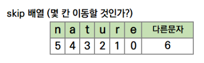

### Find sub-string Algorithm

---

- [KMP](#kmp-algorithm)
- [라빈-카프](#rabin-karp-algorithm)
- [보이어 무어](#boyer-moore-algorithm)

#

#### KMP Algorithm

---

**target_str의 앞뒤의 일치 패턴을 찾아 불필요한 반복 탐색을 막는 방법**

- 일반적으로 O(n)보다 적음
- 최악의 경우 O(mn)

1. 찾고자하는 부분 문자열(sub-string)에 대해 앞뒤(접두, 접미)의 일치 패턴의 길이를 찾는다.
   - ababbab
     - a -> 0
     - ab -> 0
     - **a**b**a** -> 1
     - **abab** -> 2
     - ababb -> 0
     - **a**babb**a** -> 1
     - **ab**abb**ab** -> 2
2. 전체 문자열에서 탐색하며 일치하지 않는 부분을 찾아 다시 탐색해야할 때 다시 탐색을 시작할 위치를 앞뒤 일치 패턴의 길이를 이용하여 선택

```python
def kmp(total_str, target_str):
	# 일치 패턴의 길이 "pi" 찾기
	pi = [0 for _ in range(len(target_str))]
	i = 0

	for j in range(1, len(target_str)):
		while i > 0 and target_str[i] != target_str[j]:
			i = pi[i - 1]

		if target_str[i] == target_str[j]:
			i += 1
			pi[j] = i

  # 패턴을 이용한 전체 문자열 탐색
	result = []
	i = 0
	for j in range(len(total_str)):
		while i > 0 and target_str[i] != total_str[j]:
			i = pi[i - 1]

		if pi[i] == total_str[j]:
			i += 1
			if i == len(target_str):
				result.append(j - i + 1)
				i = pi[i - 1]

	return result
```

#

#### Rabin-Karp Algorithm

---

**해시 값(제곱수와 해당 값의 곱)을 이용하여 target_str의 해시 값과 total_str에 포함된 문자열의 해시 값을 비교**

- 일반적으로 O(n)보다 적음
- 최악의 경우 O(mn)

1. target_str의 해시 값을 구한다.

   - _ABCD -> (ord(A) \* 3^3^) + (ord(B) \* 3^2^) + (ord(C) \* 3^1^) + (ord(D) \* 3^0^)_

2. total_str에서 target_str의 길이만큼 순회하면서 해시 값을 계산하고 target_str과 비교한다.

3. 만약 일치하지 않다면 그 다음칸으로 이동하고 비교하는 문자열의 첫 번째 해시 값을 빼고 새로운 해시 값만 더해주면 된다.

   - _해시 값 = target \* str의 길이 \* (target_str의 해시값 \- 맨 앞의 문자열 값 \* target_str의 길이^제곱수^) \+ 탐색할 total_str의 문자열_

```python
def rabin_karp(total_str, target_str):
    total_str_hash = 0
    target_str_hash = 0
		total_str_len = len(total_str)
		target_str_len = len(target_str)
    power = 1

    for i in range(target_str_len):
      total_str_hash += ord(total_str[target_str_len - 1 - i]) * power
      target_str_hash += ord(target_str[target_str_len - 1 - i]) * power
      if i < target_str_len - 1:
        power *= 2

    for i in range(1, total_str_len - target_str_len + 1):
      total_str_hash = 2 * (total_str_hash - ord(total_str[i - 1]) * power) + ord(total_str[target_str_len - 1 + i])

    	if total_str_hash == target_str_hash:
      	for j in range(target_str_len):
        	if total_str[i + j] != target_str[j]:
						break
      	else:
          print(f"{i + 1}번째에서 발견했습니다.")
```

#

#### Boyer-Moore Algorithm

---

**total_str의 뒷부분부터 비교하면 target_str에서 존재하지 않는 기준으로 불필요한 비교를 하지 않아도 됨.**

- 일반적으로 O(n)보다 적음
- 최악의 경우 O(mn)

1. target_str의 맨 뒤와 total_str의 n번째를 비교
2. n번째 요소가 있으면 target_str에서 n번째 요소가 있는 위치만큼 이동해서 다시 비교
   
3. 일치한다면 n-1번째 요소와 비교

```python
reverse_target_str = target_str[::-1]
skip_step = list(range((len(target_str))))
is_find = False

total_idx = len(pattern)-1

while total_idx < len(total_str):
    next_idx = len(reverse_target_str)
    reverse_target_idx = 0
    if reverse_target_str[reverse_target_idx] == total_str[total_idx]:
        while reverse_target_idx < len(reverse_target_str):
            if reverse_target_str[reverse_target_idx] != total_str[total_idx-reverse_target_idx]:
                break
            reverse_target_idx += 1
        if reverse_target_idx == len(reverse_target_str):
            is_find = True
    else:
        while reverse_target_idx < len(reverse_target_str):
            if s[reverse_target_str] == total_str[total_idx]:
                next_idx = min(reverse_target_idx, next_idx)
                break
            reverse_target_idx += 1
    if is_find:
        break

    total_idx += next_idx
```
