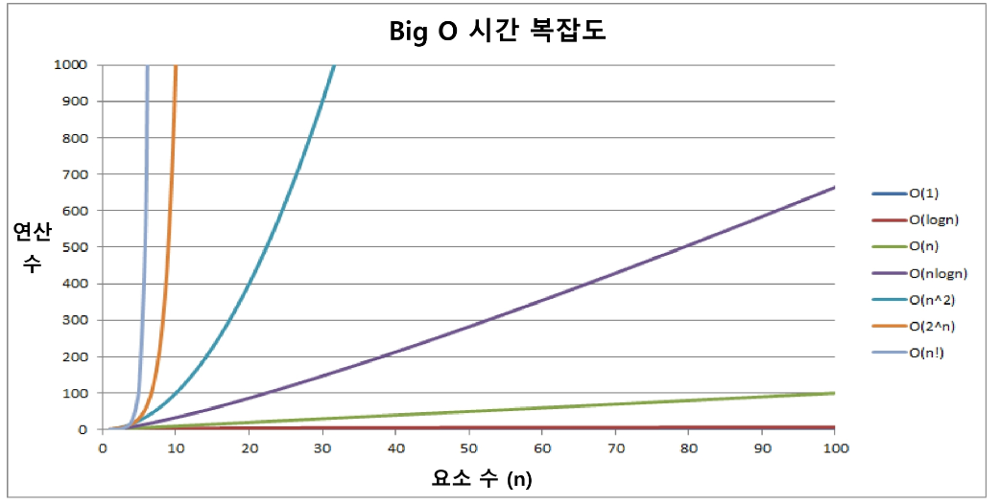

## 시간복잡도

##### 표기를 할 때에는 n항에 대해서 계수를 생략하여 표기한다.

---

- 빅-오(O) 표기법
  - 최악의 경우로 생각

#

- 빅-세타 표기법
  - 평균적인 경우로 생각

#

- 빅-오메가 표기법
  - 최선의 경우로 생각
  - 웬만한 경우에는 빅-오메가는 상수로 나옴(이미 정렬되어 있는 리스트를 정렬)

#

### 시간복잡도 계산

**ex) 크기가 N인 배열의 병합 정렬**

- `T(N) = T(N/2) + T(N/2) + N`
  - `T(N)`: 크기가 N인 배열의 병합 정렬시 걸리는 시간
  - `T(N/2) + T(N/2)`: 반으로 나누어 해결하기 때문에 N/2로 재귀됨
  - `N`: 병합시 N번 비교하며 정렬
- T(N)에 대하여 T(N/2) 값을 구해야 하기 때문에 N에 N/2를 대입하여 계산하면 T(N) = 2^2^ _ T(N/2^2^) + (2 _ N) 이 나옴 N/4 등 계속 대입하여 규칙을 찾을 수 있음
- 규칙을 통해 식을 도출 T(N) = 2^k^ _ T(N/2^k^) + (K _ N)
- `T(1) = 1`: 원소가 1개인 배열의 정렬은 1인 것을 이용하려면 T(N/2^k^)를 T(1)로 만들어야 함
- 따라서 N = 2^k^ 라는 식 사용
- N에 관한 식으로 만들기
- T(N) = N \* 1 + (k \* N), (N = 2^k^ -> k = logN)
- T(N) = N + NlogN
- **따라서 시간복잡도는 O(N) = NlogN**

#

### 알고리즘의 필요성

1. 수를 차례대로 더하는 방법

```python
def calc_sum(n):
	sum = 0 # 1번
	for i in range(1, n+1): # n번
		sum += i # n번
	return sum
# 최대 2n + 1 번의 수행(연산)
```

2. 가우스 공식으로 더하는 방법

```python
def calc_sum(n):
	return n * (n + 1) // 2 # 3번
# 최대 3번의 수행(연산)
```

#

### 다양한 시간 복잡도의 비교



- **O(1) < O(log^n^) < O(n) < O(nlog^n^) < O(n^2^) < O(2^n^) < O(n!)**

#

|  알고리즘   | 평균 수행시간 | 최악 수행시간 | 비고                                    |
| :---------: | :-----------: | :-----------: | :-------------------------------------- |
|  버블 정렬  |    O(n^2^)    |    O(n^2^)    | 구현이 간단하다.                        |
| 카운팅 정렬 |   O(n + k)    |   O(n + k)    | n이 비교적 작을 때 효율적이다.          |
|  선택 정렬  |    O(n^2^)    |    O(n^2^)    | 교환의 회수가 버블, 삽입 정렬보다 적다. |
|   퀵 정렬   |  O(nlog^n^)   |    O(n^2^)    | 평균적으로는 가장 빠르다.               |
|  삽입 정렬  |    O(n^2^)    |    O(n^2^)    | n이 비교적 작을 때 효율적이다.          |
|  병합 정렬  |  O(nlog^n^)   |  O(nlog^n^)   | 연결리스트의 경우 가장 효율적이다.      |
