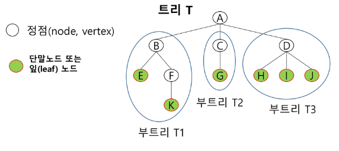
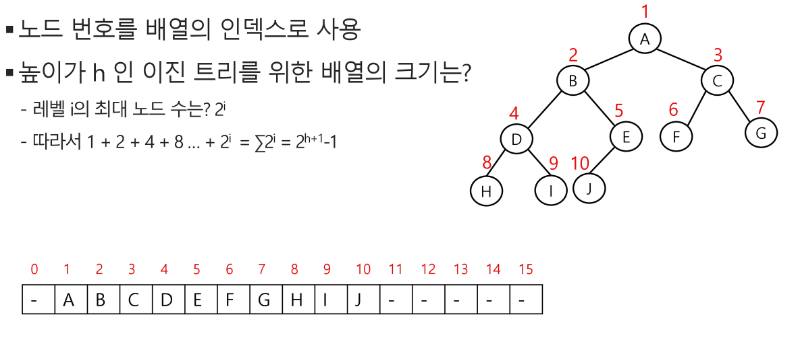
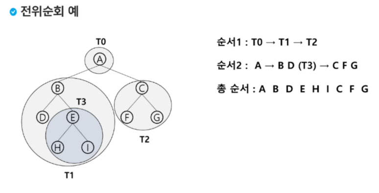
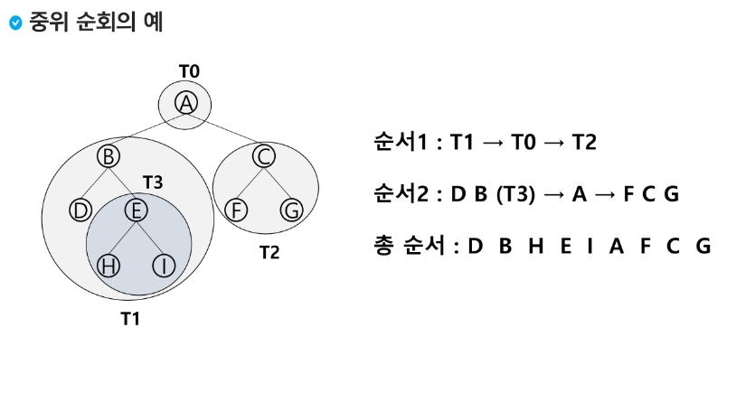
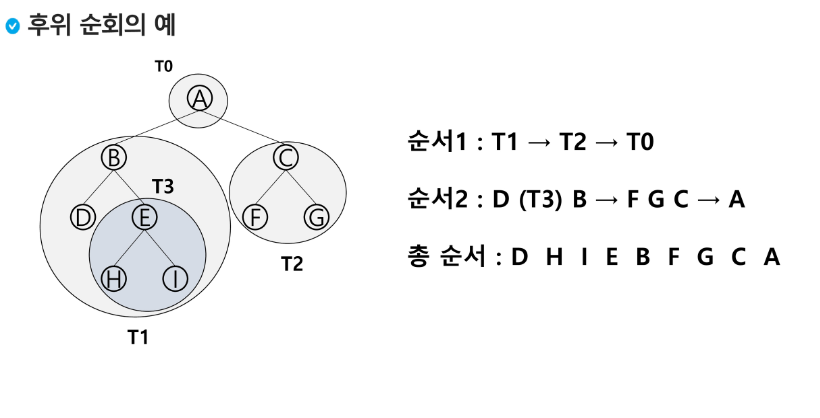

## Tree

- 원소들 간에 1:n 관계를 가지는 구조
- 원소들 간에 계층관계를 가지는 계층형 구조
- 비선형 구조



- [Binary Tree](#binary-tree)
- [Traversal](#tree-순회)
- [Expression](#배열을-이용한-이진트리-표현)
- [용어 정리](#용어정리)

#

#### 이진 트리

- 모든 노드들이 **2개의 서브 트리**를 갖는 형태의 트리
- 왼쪽 자식 노드(left child node)
- 오른쪽 자식 노드(right child node)
- 높이가 h일 때, 노드의 **최소 개수는 (h+1)개**, **최대 개수는 (2^h+1^-1)개**가 된다.
- **포화 이진 트리(Full Binary Tree)**: 모든 레벨에 노드가 2개의 자식을 다 가진 형태
- **완전 이진 트리(Complete Binary Tree)**: 노드의 1번과 왼쪽 방향부터 빈자리가 없는 경우(**포화 이진트리가 아니어도 됨**)
- 편향 이진 트리(Skewed Binary Tree): 한쪽 방향으로만 자식 노드를 가진 트리

#

#### 이진 탐색 트리

- 탐색작업을 효율적으로 하기 위한 트리구조
- 부모를 기준으로 작은 것은 왼쪽 자식노드로, 크면 오른쪽 자식노드로 보내서 찾는 값을 기준으로 크기를 비교하여 탐색할 수 있음
- 이진 탐색과 마찬가지로 미리 정렬이 돼 있어야 함

1. 탐색
2. 삽입
3. 삭제

#### 힙 트리

#

#### 배열을 이용한 이진트리 표현

`왼쪽 자식 노드 = 부모노드 * 2`
`오른쪽 자식 노드 = 부모노드 * 2 + 1`



#### 연결리스트를 이용한 이진트리 표현

| left | data | right |
| ---- | ---- | ----- |

```python
class Node:
	def __init__(self, data):
		self.data = data
		self.left = None
		self.right = None

root = Node(1)
root.left = Node(2)
root.right = Node(3)
root.left.left = Node(4)
```

#

#### Tree 순회

- 각 노드를 중복되지 않게 전부 방문
- 트리는 비선형 구조이기 때문에 선형 구조에서처럼 전후 연결 관계를 알 수 없음

**1. 전위순회(VLR)**



```python
def preorder(node):
	if node:
		print(node.data, end=" ")

		preorder(node.left)
		preorder(node.right)
```

**2. 중위순회(LVR)**


```python
 def inorder(node):
	if node:
		inorder(node.left)

		print(node.data, end=" ")

		inorder(node.right)
```

**3. 후위순회(LRV)**


```python
def postorder(node):
	if node:
		postorder(node.left)
		postorder(node.right)

		print(node.data, end=" ")
```

#

#### 용어 정리

- **노드(node)**: 트리의 원소
- **루트(root)**: 트리의 시작 노드
- **간선(edge)**: 부모와 자식 노드를 연결하는 선
- **차수(degree)**:
  - 노드의 차수: 연결되어 있는 **자식** 노드의 개수
  - 트리의 차수: 해당 트리의 노드의 차수 중에서 **가장 큰 값**
  - 단말 노드: **차수가 0**인 노드
- **높이(단계), 레벨**:
  - 노드의 높이: 루트에서 노드에 이르는 간선의 수
  - 트리의 높이: 트리에 있는 노드의 높이 중에서 **가장 큰 값**
  - **루트의 높이는 0**
