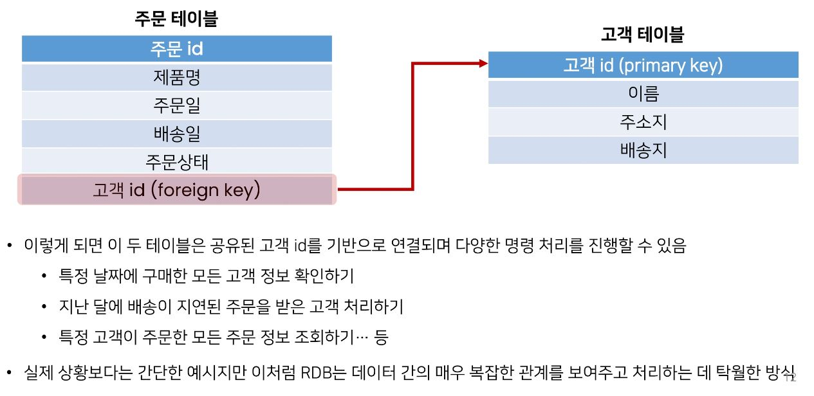

# RDB의 관계

- 테이블 간의 상호작용을 기반으로 설정되는 테이블 간의 논리적인 연결

> 예시
> 

- 외래 키(외부 키)

1. 1:1 관계
   - 한 테이블의 레코드 하나가 다른 테이블의 레코드 단 한 개와 관련된 경우
2. N:1 관계
   - 한 테이블의 0개 이상의 레코드가 다른 테이블의 레코드 한 개와 관련된 경우
3. M:N 관계
   - 한 테이블의 0개 이상의 레코드가 다른 테이블의 0개 이상의 레코드와 관련된 경우
   - 양쪽 모두에서 N:1 관계를 가짐
