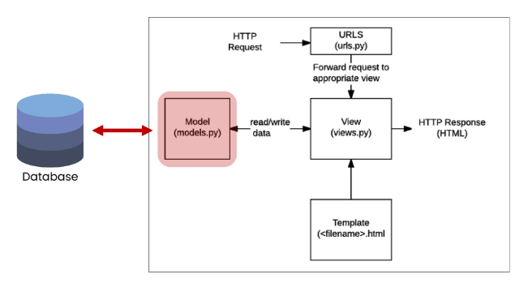

# Model

- 앱 안의 models.py를 통해 model을 정의하고 관리
- 일반적으로 모델클래스 하나에 DB 테이블 한 개가 mapping

  

### 스키마 정의

- 모델 클래스를 작성하는 것은 데이터베이스 테이블의 스키마를 정의하는 것

```python
# apps/models.py
from django.db import models

# 스키마 정의
# models 모듈의 Model 클래스를 상속받아 구성됨
# pk(id)는 기본적으로 할당됨
class SomeModel(models.Model):
	# title은 문자로 최대길이는 10
	title = models.CharField(max_length=10)
	# content는 최대길이가 필요없는 문자
	content = models.TextField()
```

- `DateTimeField`: 날짜 및 시간(datetime.datetime)을 값으로 사용하는 필드
  - `auto_now_add`: 최초 생성 일자
  - `auto_now`: 최종 수정 일자

### 모델 생성

- 정의한 스키마를 기반으로 데이터 모델을 생성 혹은 변경된 스키마에 대한 모델 업데이트

```
$ python manage.py makemigrations
```

- 스키마를 수정하는 상황에서 칼럼을 추가하고 위 명령어를 통해 업데이트를 진행하면
- 새로운 칼럼에 기본 값의 설정이 필요함(빈 값을 추가할 수는 없게 되어 있음)

### 모델을 DB에 반영

- 생성된 모델을 실제 DB 파일에 반영
- 모델을 수정한 후에도 DB에 반영이 필요함(모델을 수정하면 기존 모델에 덮어쓰는 것이 아니라 새로운 모델을 다시 생성하기 때문에)

```
$ python manage.py migrate
```

#

## ORM(Object Relational Mapping)

- Django(python)과 DB(SQL)은 서로 언어가 다르기 때문에 이 둘의 해석을 담당하는 기술
- SQL을 몰라도 객체지향 언어로 DB조작이 가능하여 생산성이 높음
- 하지만 ORM만으로는 완벽한 서비스를 구현하기는 힘듦

### ORM 실행 환경

- 실습 편의를 위한 라이브러리 설치

  - `$ pip install ipython`: 더 강력한 파이썬 쉘, 일반 파이썬 쉘은 Django 프로젝트 환경에 영향을 줄 수 없기 때문에 사용
  - `$ pip install django-extentions`: shell_plus, graph model 등 확장 기능 제공

    ```python
    # setting.py

    INSTALLED_APPS = [
    	'django_extensitons`,
    	...,
    ]
    ```

#

### ORM 명령어

`$ pip manage.py shell_plus`: shell_plus 실행

> 이러한 데이터 테이블들은 SQLite에서 확인 가능 (vscode extentions)

### CRUD

- GET: READ에 해당. DB를 조작하지 않음
- POST: CREATE, UPDATE, DELETE에 해당. DB를 조작하므로 CSRF Token이 필요함
- ``

**CREATE: 데이터 객체 만들기**

```python
# 인스턴스 생성
인스턴스명 = 스키마명(초기값 할당 가능)
인스턴스.칼럼 = "something"
# DB에 데이터 저장
인스턴스.save()
```

or

```python
# create() 메서드 활용
# 인스턴스 생성 및 초기값 할당
인스턴스 = 스키마명.objects.create(초기값 할당)
인스턴스.save()
```

#

**READ: 데이터 읽기**

_all()_: 전체 데이터 조회

```
In [1]: 스키마이름.objects.all()
Out [1]: <QuerySet []>
```

_get()_: 단일 데이터 조회(1개)

```
In [1]: 스키마이름.objects.get(조건)
Out [1]: <스키마이름: 스키마이름 object (1)>
```

_filter_: 조건에 맞는 데이터 조회(개수 상관없이 새로운 query set으로 반환)

```
In [1]: 스키마이름.objects.filter(조건)
Out [1]: <QuerySet [<스키마이름: 스키마이름 object (1)>]>
```

#

**UPDATE: 데이터 수정**

```python
# 수정하고자하는 데이터 조회하여 반환 값 저장
대상인스턴스 = 스키마명.objects.get(조건)
# 수정
대상인스턴스.칼럼 = "new_something"
# 저장
대상인스턴스.save()
```

**DELETE: 데이터 삭제**

```python
# 삭제하고자하는 데이터 조회하여 반환 값 저장
대상인스턴스 = 스키마명.objects.get(조건)
# 삭제
대상인스턴스.delete()
```

+) 스키마 정의 클래스에 "\_\_str\_\_" 메서드를 통해서 각 object를 문자열로 반환 시킬수도 있음

```python
class Customer(models.Model):
	title = models.CharField(max_length=10)
	age = models.IntegerField()

  # 스키마가 변경 됐기 때문에 수정사항을 업데이트하고
	# DB에 반영 해주어야함
	# __str__은 작성후 shell 재시작까지 필요함
	def __str__(self):
		return self.title
```

### Admin site

- 관리자 페이지
- `$ python mange.py createsuperuser`
- http://127.0.0.1:8000/admin/

  ```python
  # 앱이름/admin.py

  from django.contrib import admin
  from .models import 스키마명

  admin.site.register(스키마명)
  ```
