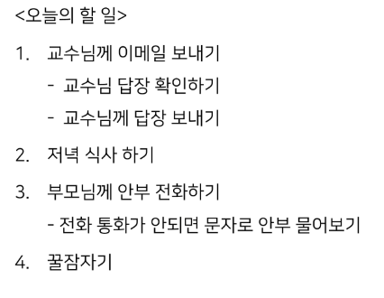

# 동기와 비동기(Synchronous and Asynchronous)



### 동기

- 동기의 경우에는 교수님에게 답장이 오지 않으면 저녁식사를 진행하지 못 함
- 이전 작업이 끝나야 다음 작업을 시작함
- 일반적인 python 코드는 모두 동기식
- 이러한 경우에는 클라이언트가 서버의 응답을 기다리는 동안 아무것도 할 수 없음

### 비동기

- 비동기의 경우에는 교수님의 답장을 기다리는 동안 저녁 식사를 진행할 수 있음
- 작업의 결과를 기다리지 않고 다음 작업을 처리하는 것(병렬적 수행)
- JavaScript는 싱글 스레드이기 때문에 비동기를 위해서 브라우저나 node.js의 도움을 받음
- 하지만 코드의 실행 순서에 대해 불명확해진다는 단점이 있음

#

### 비동기 동작 과정(브라우저 환경)

1. 모든 작업은 Call Stack(LIFO)으로 들어간 후 처리된다.
2. 오래 걸리는 작업(또는 setTimeout 등)은 Call Stack에서 Web API에 별도로 보내버린다.
   - setTimeout은 지연시간이 0초여도 Web API로 보내짐(zero delay)
   - zero delay시 Web API -> Task Queue의 과정을 거치면서 delay가 더 일어남
3. Web API에서 처리가 끝난 작업들은 Task Queue(FIFO)로 들어간다.
4. Event Loop가 Call Stack이 비어있는 것을 체크하고 Task Queue에서 가장 오래된 작업을 Call Stack으로 옮긴다.

#### Axios

- JavaScript의 HTTP 웹 통신을 위한 라이브러리
- 확장 가능한 인터페이스와 쉬운 비동기 통신 기능 제공
- *https://axios-http.com/kr/docs/intro*
- *https://github.com/axios/axios*

```js
axios.get("요청할 URL")
// 응답 정보는 then의 콜백함수의 첫번째 인자로 들어옴
	.then(성공하면 수행할 콜백함수)
	.catch(실패하면 수행할 콜백함수)
```

#

### 콜백 함수를 통한 비동기 제어

- 비동기 처리의 순서를 제어하기 위해 콜백 함수를 이용할 수 있음
- "어떤 이벤트가 발생하면", "요청이 들어오면" 등 조건을 통해 순차적 제어가 가능
- 하지만 이러한 콜백 함수가 여러개 겹쳐지면 콜백 지옥이 나타날 수 있음
- 이러한 문제를 해결하기 위해 `Promise`객체를 사용

```js
// 비동기의 콜백 함수 작성 방식
work1(function () {
  // work1
  work2(result1, function (result2) {
    // work2
    work3(result2, function (result3) {
      // work3
    });
  });
});
```

### Promise(프로미스)

- "작업이 끝나면 실행 시켜줄게"라는 약속(promise)
- 비동기 작업의 완료 또는 실패를 나타내는 객체
- Axios도 Promise를 기반으로 한 라이브러리

### `then`

- 요청한 작업이 성공하면 callback 실행
- callback은 이전 작업의 성공 결과를 인자로 전달 받음

### `catch`

- then()이 하나라도 실패하면 callback 실행
- callback은 이전 작업의 실패 객체를 인자로 받음

> then과 catch 모두 항상 promise 객체를 return하기 때문에 계속해서 return을 다시 받아 promise를 사용할 수 있음(chaining)

```js
// 비동기의 promise 작성 방식

// work1
// return이 없으면 다음 then을 실행할 수 없음
// 몇 단계의 then으로 나눌지는 개발자의 선택, 유지보수에 용이함
work1()
  .then((result1) => {
    // work2
    return result2;
  })
  .then((result2) => {
    // work3
    return result3;
  })
  .catch((error) => {
    // error handling
  });
```
