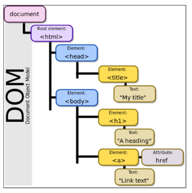

### DOM

- 웹 페이지의 객체 지향적인 표현
- 프로그래밍 언어가 접근 가능한 문서의 구조화된 표현(각 요소를 객체로 취급)을 제공
- 문서 구조, 스타일, 내용 등을 변경할 수 있게 도와줌
- HTML/CSS를 조작할 수 있음



#### Parsing

- 구문 분석, 해석
- 브라우저가 문자열을 해석하여 DOM Tree로 만드는 과정

#### window oject

- DOM을 표현하는 가장 최상위 객체
- 각 탭마다 하나의 window로 표현
- window는 직접적으로 사용하지 않는 이상 생략

```js
// 새 탭 열기
window.open();

// 경고창 표시
window.alert();

// 인쇄 대화 상자 표시
window.print();
```

#### document object

- 브라우저가 불러온 웹 페이지
- 컨텐츠의 진입점 역할

#### NodeList

- index로만 각 항목에 접근 가능
- 배열의 forEach 메서드 및 다양한 메서드 사용 가능(하지만 정확한 타입은 배열이 아니다)
- `querySelectorAll()`으로 반환된 NodeList는 DOM에 변경사항을 실시간으로 반영하지 않는다.**(NodeList를 순회중이거나 길이값등 사용중일 때 실시간으로 영향을 주지 않기 위해서)** = **정적인 컬랙션**
- 나머지의 NodeList들은 실시간으로 반영됨 = **라이브 컬랙션**
- 보통 라이브 컬랙션을 사용하고 싶을 땐 `Node.childNodes`를 사용

### DOM 조작

- `createElement(tagName)`

  - 작성한 tagName의 HTML 요소를 생성, 반환

- `Node.innerText`

  - Node 객체와 그 자손의 **텍스트**(DOMString)를 표현
  - 줄바꿈을 인식, 숨겨진 내용 무시 등 최종적으로 스타일링된 모습을 표현

- `Node.appendChild(targetNode)`

  - 한 targetNode를 특정 Node의 자식 NodeList 중 마지막 자식으로 삽입

- `Node.removeChild(targetNode)`

  - Node의 자식 targetNode를 제거하고 반환

- `Element.getAttribute(name)`

  - 해당 요소의 지정된 값(문자열)을 반환
  - `name`은 값을 얻고자 하는 속성의 이름

- `Element.setAttribute(name, value)`
  - `name`속성에 `value` 값으로 설정
  - 속성이 이미 존재하면 값을 갱신, 존재하지 않으면 새 속성으로 추가
