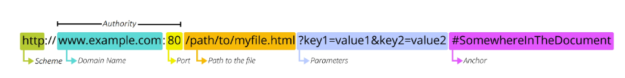

# URL (Uniform Resource Locator)

- 웹에서 주어진 리소스의 주소
- 네트워크 상에 리소스가 어디 있는지를 알려주기 위한 약속

#### Scheme / Protocol

- 브라우저가 리소스를 요청하는 데 사용해야 하는 프로토콜
- 웹은 `HTTP(S)`, 메일은 `mailto`, 파일전송은 `ftp` 등이 존재

#### Authority

- domain과 port를 포함하며 이 둘은 ":"으로 구분
- HTTP는 80번 port, HTTPS는 443번 port가 표준으로 지정되어 있어 이 둘은 생략 가능

#### Path

- 웹 서버 리소스의 경로
- path를 통해 실제적인 절대주소를 표현할 수도 있지만 요즘은 실제 위치가 아닌 추상화된 경로로 표현
- `/articles/create/`가 실제 articles 폴더의 create 폴더를 의미하는게 아닐 수 있음

#### Parameters

- 웹 서버에 보내는 추가적인 요청 데이터
- "?"로 시작하고 "&"로 이어지는 key-value 쌍 목록
- 서버에서는 리소스를 응답해주기 전에 parameter를 통해서 추가 작업을 수행함

#### Anchor

- 응답되는 리소스에 대한 특정 부분을 나타냄
- "#"으로 시작하고 이 부분은 서버에 전송되지 않고 브라우저에서 처리함
- 브라우저에서 응답받은 리소스에 대해 해당 지점으로 이동해줌

#

## URN

- 리소스의 위치와 관계 없이 고유한 이름으로 식별
- URL의 단점을 극복하기 위해서 등장했지만 아직은 보편화 돼 있지 않음
