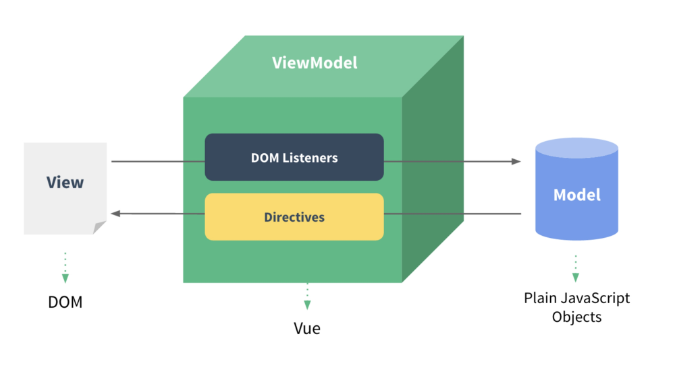

## Vue
- Vue3가 있지만 아직은 Vue2가 안정적이고 많이 사용됨

- MVVM Pattern 사용
	- View: 우리 눈에 실제로 보이는 부분(DOM)
	- Model: 실제 데이터(JSON)
	- View Model(Vue):
		- View를 위한 Model
		- View와 연결(binding)되어 Action을 주고받음
		- Model이 변경되면 View Model도 변경되고 바인딩된 View도 변경됨
		- View에서 사용자가 데이터를 변경하면 View Model의 데이터가 변경되고 바인딩된 다른 View도 변경됨


	- 마크업으로 구현하는 인터페이스(view) 부분을 Backend(model)로부터 분리시키는 패턴
	- View와 Model 서로가 독립적(의존성 감소)
	- view가 어느 특정한 모델에 종속되지 않게 함

### Vue의 장점
- 구조가 매우 직관적임
```html
<!-- 입력 받은 값을 name 뒤에 출력하기 -->
<div id="app">
	 <p id="name">name: </p>
	 <input id="inputName" type="text">
	</div>
```
```js
// vanila.js

const name = document.querySelector("#name")
const input = document.querySelector("#inputName")
input.addEventListener("input", function (e) {
	...
})
```

```js
// vue.js

const app = new Vue({
	el: "#app",
	data: {
		message: "",
	},
})
```

- 눈에 보이는 화면을 조작하는 것이 아닌 Vue가 가진 data를 조작
- input에 값을 입력 -> Vue data에 반영 -> Dom 반영
- vanila JS에서는 여러가지 공통된 값을 변경하려면 위치에 따른 값을 전부 선택해서 바꿔야했지만
- Vue에서는 변수처럼 하나의 데이터로 관리가 가능