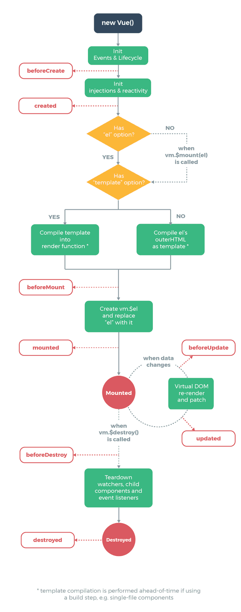

## Vue Lifecycle



1. created 
	- 뷰 인스턴스 초기화 단계
	- 뷰의 컴포넌트에는 접근이 불가능한 단계
	- 화면에 데이터만 초기화를 한다
	- **실행 순서: 상위 -> 하위**

```html
...
<script>
	const app = new Vue({
		el: "#app",
		// 뷰(화면) 생성 시 실행할 내용
		created() {
			...
		}
	})
</script>
```

2. mounted
	- 컴포넌트를 렌더링하는 단계
	- 컴포넌트로의 접근이 가능해진다
	- **실행 순서: 하위 -> 상위**
		- 하위의 렌더링을 끝내야 상위가 끝나기 때문

3. updated
	- 컴포넌트의 변경이 일어나거나 재렌더링이 발생하면 실행되는 단계

```html
...
<script>
	const app = new Vue({
		el: "#app",
		// 뷰(화면) 변경 시 실행할 내용
		updated() {
			...
		}
	})
</script>
```

4. destroyed
	- 뷰 인스턴스가 제거되는 단계
	- 화면이 닫히기 때문에 console 등으로 확인은 어렵고 다른 파일에 로그 저장 등으로 활용