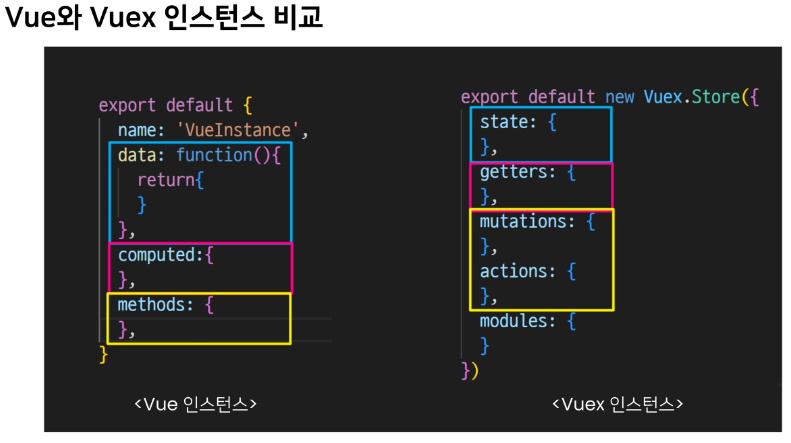
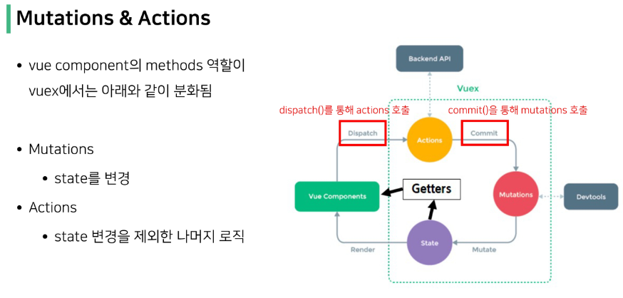

# Vuex
- 중앙 저장소를 통해 상태 관리를 할 수 있도록 해주는 라이브러리
- 여러개의 component가 각각의 상태(data)를 가짐
- 이러한 component들이 모여서 하나의 App을 구성하기 때문에 component들이 같은 상태를 유지할 필요가 있음

### Pass props & Emit Event
- 각 컴포넌트들이 props와 event를 통해서 데이터를 공유하여 상태 관리를 하고 있었음
- 데이터의 흐름을 직관적으로 확인할 수 있었지만 중첩이 깊어지면 데이터 전달이 쉽지가 않음
- 이러한 단점을 **Vuex**를 이용해서 중앙 저장소에 데이터를 모아서 상태를 관리

### Vuex의 핵심 컨셉 4가지
```js
// vuex 프로젝트 생성 시 기본 파일
// src/store/index.js

import Vue from 'vue'
import Vuex from 'vuex'

Vue.use(Vuex)

export default new Vuex.Store({
	state: {
	},
	getters:{
	},
	mutations: {
	},
	actions: {
	},
	modules: {
	}
})
```

#
**1. State**
- **중앙에서 관리하는 모든 상태 정보**
- vue 인스턴스의 data에 해당
- 중앙에서 관리하는 모든 상태 정보
- 개별 component가 관리하던 data를 중앙 저장소에서 관리하게 됨
- 개별 component는 state에서 데이터를 가져와서 사용
- state의 데이터에 변화가 생기면 해당 데이터를 공유하는 component도 다시 렌더링
- `$store.state`로 state 데이터에 접근
#
**2. Mutations**
- **state를 변경하기 위한 methods**
- vue 인스턴스의 methods에 해당하지만 동기적인 함수만 호출 해야함(비동기를 이용하면 state 변화 시기를 특정할 수 없어서)
- 실제로 state를 변경하는 유일한 방법
- 첫 번째 인자로 `state`를 받으며, component 혹은 Actions에서 `commit()`을 통해 호출됨
#
**3. Actions**
- **비동기 작업이 포함될 수 있는(외부 API와의 소통 등) methods**
- **state를 변경하는 것 이외의 모든 작업 진행**
- mutations와 비슷하지만 비동기 작업을 포함할 수 있음
- state를 직접 변경하지 않고 `commit()`메서드로 mutations를 호출해서 state를 변경함
- context 객체를 인자로 받으며 이 객체를 통해 store.js의 모든 요소와 메서드에 접근할 수 있음
- 즉, state를 직접 변경할 수는 있지만 하지는 않아야함
- component에서 `dispatch()` 메서드에 의해 호출됨
#
**4. Getters**
- **state를 활용해 계산한 새로운 변수 값**
- vue 인스턴스의 computed에 해당
- state의 원본 데이터를 건들지 않고 계산된 값을 얻을 수 있음
- computed와 마찬가지로 getters의 결과는 캐시되며 종속된 값이 변화할 때만 재계산됨
- getters에서 계산된 값은 state에 영향을 미치지 않음
- 첫 번째 인자로 `state`, 두 번째 인자로 `getter`를 받음


#
### 정리
- component에서 데이터를 조작하기 위한 흐름
	- `component -> (actions) -> (mutations) -> state`
- component에서 데이터를 사용하기 위한 흐름
	- `state -> (getters) -> component`