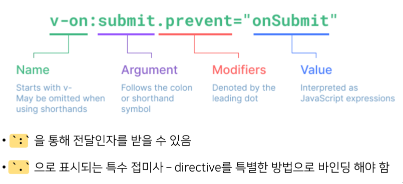

# directive
- HTML의 기본속성이 아닌 Vue가 제공하는 특수 속성의 값으로 data를 작성
- `v-이름`의 형태로 값에는 JS 표현식을 작성할 수 있음

- 표현식의 값이 변경될 때 반응적으로 DOM에 적용하는 것이 역할
#

### Built-in directives
`v-text`
- template interpolation처럼 기본적인 바인딩 방법
- 1, 2의 결과는 같음
```html
<div id="app2">
	<!-- 1 -->
	<p v-text="message"></p>
	<!-- 2 -->
	<p>{{ message }}</p>
</div>

<script>
	const app2 = new Vue({
		el: "#app2",
		data: {
			message: "hello!",
		}
	})
</script>
```
#
`v-html`
- raw html을 표현할 수 있는 방법(html 문법을 그대로 표현)
- 사용자가 입력하는 부분에서는 사용 금지(XSS 공격 취약)
```html
<div id="app2">
	...
	<p v-html="some-html"></p>
</div>

<script>
	const app2 = new Vue({
		el: "#app2",
		data: {
			...,
			some-html: "<a href='#'>HI</a>"
		}
	})
</script>
```
#
`v-show`
- *Expensive initial load, cheap toggle*
- boolean 값이 변경될 때마다 반응
- 값에 따라 해당 element를 보여줄지 말지를 결정
- display 속성을 기본 값과 none으로 toggle
	- display 속성만 변경되었을 뿐 DOM에는 존재함
```html
<div id="app3">
	...
	<p v-show="isActive">보이니 안보이니?</p>
</div>

<script>
	const app3 = new Vue({
		el: "#app3",
		data: {
			isActive: false
		}
	})
</script>	
```
#
`v-if`
- *Cheap initial load, expensive toggle*
- `v-show`와 사용 방법은 동일
- 단, 값이 false인 경우 DOM에서 아예 사라짐
- 표현식 값이 자주 변경되지 않을 때 사용

#
`v-for`
- python처럼 `for .. in ..` 형식으로 작성
- 반복가능한 데이터 타입에 모두 사용 가능
- (data, index) 형태로 `enumerate`처럼 index도 접근 가능
- (key, value) 형태로 객체의 키와 값에 접근 가능
- 각 요소가 객체라면 `dot notation`으로도 접근 가능

```html
<div id="app1">
	<div v-for="(char, index) in myStr">
		<p>{{ index }}번째 문자 {{ char }}</p>
	</div>
</div>

<script>
	const app1 = new Vue({
		el: "#app1",
		data: {
			myStr: "hello"
		}
	})
</script>	
```

#
`v-on`
- `addEventListener`와 동일한 역할
- `:`를 통해 `addEventListener`의 첫 번째 인자와 동일한 형태의 값을 전달
- 대기하고 있던 이벤트가 발생하면 할당된 표현식 실행
- `v-on` 대신 `@`로 단축하여 사용 가능

```html
<div id="app">
	<button v-on:click="number++">
		increase Number
	</button>
	<p>{{ number }}</p>
</div>

<script>
	const app = new Vue({
		el: "#app",
		data: {
			number: 0,
		},
	})
</script>
```

#
`v-bind`
- HTML 기본 속성에 Vue data를 연결
- class의 경우 다양한 형태로 연결 가능
- `:`로 단축하여 사용 가능
	- 조건부 바인딩
		- `{className: 조건표현식}`
		- 삼항연산자
	- 다중 바인딩
		- `[표현식1, 표현식2, ...]`
- Vue data의 변화에 따라 DOM에 반영하므로 상황에 따라 유동적으로 할당 가능

```html
<div id="app">
	<a v-bind:href="url">Go to Google</a>
</div>

<script>
	const app = new Vue({
		el: "#app",
		data: {
			url: "https://www.google.com/",
		},
	})
</script>
```

#
`v-model`
- Vue instance와 DOM의 양방향 바인딩
- Vue data 변경 시 v-model로 연결된 사용자 입력 element에도 변경이 반영

```html
<div id="app">
	<h3>{{ msg }}</h3>
	<input v-model="msg" type="text">
</div>

<script>
	const app = new Vue({
		el: "#app",
		data: {
			msg: "",
		},
	})
</script>
```

Q 그럼 클래스 바인딩때 빼고 {{}}랑 차이는?